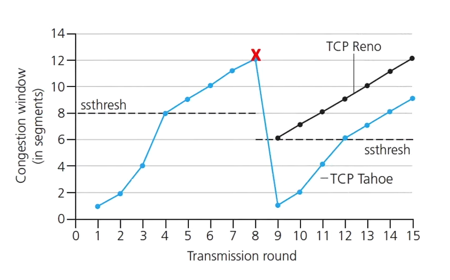

2025-05-25 12:11

Status: #in-writing 
Tags: #transportlayer #communication #it #tcp #congestioncontrol

# Congestion control

Congestion control is about not overwhelming one router in the network. If that one router receives too many packets on each link then it might fill up the buffer and start dropping packets. If the senders continue to send packets then the network will get congested and re-sending packets is a big waste of throughput. This is part of the reason congestion control is a major concern in communication networks like the internet.
When there is multiple [[Packet switching|packet switches]] in between each end and if there is high enough congestion, the throughput might go to 0. And this is called a congestion collapse.

### Two ways of dealing with congestion
### End-end congestion control
This way of dealing with congestion is done by the sender. If the sender experience delays or lost packets, then the sender will adjust the sending rate. That way the routers that might be congested will get less traffic and the packets lost will decrease. This method is used by [[Transmission control protocol|tcp]]. 

### Network-assisted congestion control
This is a more direct way of dealing with congestion by the [[Packet switching|router]]. If the router starts getting congested it will indicate the congestion to the ends or might even set sending rate directly. This feedback can help prevent any loss at all. Some of the newer implementations of [[Transmission control protocol|tcp]] have this implemented. 
### Congestion control in [[Transmission control protocol|tcp]]
#### AIMD: Additive Increase Multiplicative Decrease
This algorithm is simple in the way it functions but is still the backbone of how every [[Transmission control protocol|tcp]] implementation must behave. 
The algorithm increases the sending rate by 1 [[maximum segment size]] (MSS) every [[round trip time|rtt]] until loss is detected. When loss is detected the algorithm will cut the sending rate in half. Loss is defined as receiving triple duplicate ACKs and this is the only time the sending rate will decrease. When there is a timeout for an ACK on the senders side it will reset the size of the window to 1 [[Maximum segment size|MSS]]. This gives a saw graph for the sending rate. 
##### The slow start
When the sending rate reset to 1 [[Maximum segment size|MSS]] the increase will start increasing exponentially. This way the sending rate gets back to a good rate fast, but when should it swap from exponentially to AIMD? The threshold is based on the last sending rate from before the loss: 
$$
ssthresh = \frac{cwnd}{2}
$$

#### TCP CUBIC 
The CUBIC implementation of the tcp congestion control is almost the same as the [[#AIMD Additive Increase Multiplicative Decrease|AIMD]] implementation. But when the rate is cut in half it increases the rates differently. It starts by picking a point forward in time K. Then it would increase the rate by the cube of the difference between the current time and K. With this function we get to the last loss much faster, and this is better because it is more likely that sending rate is the bottleneck. This is the version of tcp that is implemented in the [[linux]] implementation of tcp found [here](https://git.kernel.org/pub/scm/linux/kernel/git/torvalds/linux.git/tree/net/ipv4/tcp.c). 

## References