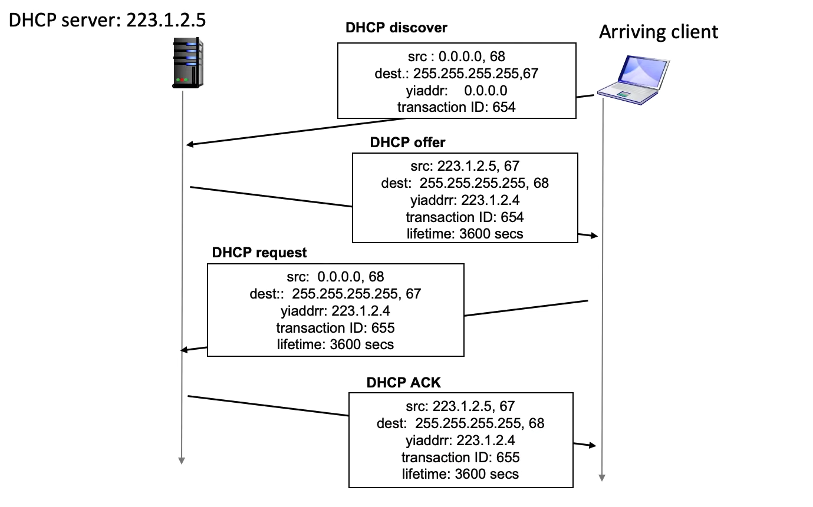

---
aliases:
  - dhcp
  - DHCP
---

2025-05-26 15:48

Status: #in-writing 
Tags: #communication #networklayer #it #ip #ipv4 #ipv6 

# Dynamic Host Configuration Protocol
DHCP is the protocol responsible for distributing ip addresses to hosts on a network. The protocol consists of a DHCP server and hosts on the network. On home networks the DHCP server is often the home router and this service is enabled by default. The goal with DHCP is that new hosts joining the network automatically can get assigned a unused ip, and for old hosts can be reassigned the same ip for each time they leave or rejoin the network. 
#####  DHCP message overview:
- host can broadcast **DHCP discover** *msg \[optional]*
- DHCP server responds with **DHCP offer** *msg \[optional]*
- host request ip address **DHCP request** *msg*
- DHCP server responds with **DHCP ack** *msg*
### The DHCP message flow

#### Other services DHCP provides
While DHCPs main purpose is to distribute ip addresses it can still help with other configuration aspects of the client arriving on the network. 
###### Other DHCP services:
- Provide the address of first-hop router for client
- Provide name and ip of DNS server
- Indicate the network mask to the client