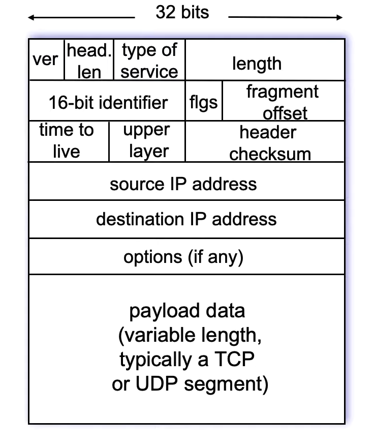

---
aliases:
  - ip
  - IP
---

2025-05-26 13:04

Status: #in-writing 
Tags: #communication #networklayer #ip #ipv4 #ipv6 #dns #routing 

# Internet protocol
The internet protocol is the backbone of all communication on the entire internet. Every form of communication is in some way packed into ip datagrams and sent to the link layer. An important thing to remember when talking about the the internet protocol is that it is mainly a way to address the different interfaces on a network. Every interface that is connected to a network has to have an ip address, and routers will use these addresses to route packets through the networks. [[Internet Corporation for Assigned Names and Numbers|ICANN]] is the highest administrator of all the ip addresses in the world, and they distribute them to regional registries that then again redistributes them to [[Internet service provider]]s. For us users are there two versions of ip:
## IPv4
This is the old version of the internet protocol, and in this version every [[ip address]] is 32-bits or 4 bytes. To cover every device on a network with the size of the entire internet you would need way more than this and this is the reason we need technologies that divide up all the addresses. Each part of the network that can see each other without going through a [[router]] is called a [[#subnets|subnet]]. 
### The IPv4 datagram format
This is the structure of the ip datagram:

The first part of the header is always the version, and this is so that any program reading the datagram will know what the other fields correspond to. 
We have both the header length, and the datagram length since the header and payload has variable length. The normal size of datagrams is 1500 bytes, this allows them to fit into a payload of the [[ethernet]] [[link layer]] frame. 
The "type of service" field has been used for multiple things over the years, but the most important use today is the explicit congestion notification (ECN) bit. This bit is flipped by routers and used by the [[transport layer]] to avoid [[Congestion control|congestion]]. 
Time to live is decreased once for every router the datagram passes by. If it reaches zero the datagram will not be sent. This is to avoid zombie datagrams that never reach a destination. 
Upper layer indicates what transport protocol is used. And header checksum is self explanatory. 
After this is the ip addresses and any options.
#### Overhead
With this we get at least 40 bytes of overhead for [[Transmission control protocol|TCP]]/[[Internet protocol|IP]].
20 bytes from tcp + 20 bytes from ip + app layer overhead
### Subnets
A subnet is defined as interfaces on a network that can physically communicate without needing to go through a [[router]]. The way this is standardized is by dividing up the ip address into two parts, host part and subnet part. All devices on the same subnet should share the same subnet part and be different on the host part. When we describe subnets we often describe it using the CIDR notation. 
#### Classless InterDomain Routing (CIDR)
The CIDR notation means that the first x bits behind the / is the subnet part of every ip on that subnet. For example 223.1.1.0/24 would mean a subnet with every ip address on the form **223.1.1.x**. The rest of the ip address would be the host specific of the ip address. An important observation is that the smaller the subnet part of the ip the bigger the subnet is, with a /24 network there is only $2^8$ possible addresses on the range, and some of them are even reserved. Because on every network the 255.255.255.255 ip is reserved for broadcasting to the entire network, and 0.0.0.0 ip refers to "this" network. [Full list of reserved ip addresses](https://en.wikipedia.org/wiki/Reserved_IP_addresses).
### [[Network address translation]]

## IPv6

## How to get an [[ip address]]

### Set ip on host

### Dynamic Host Configuration Protocol (DHCP)
[[Dynamic Host Configuration Protocol]]
