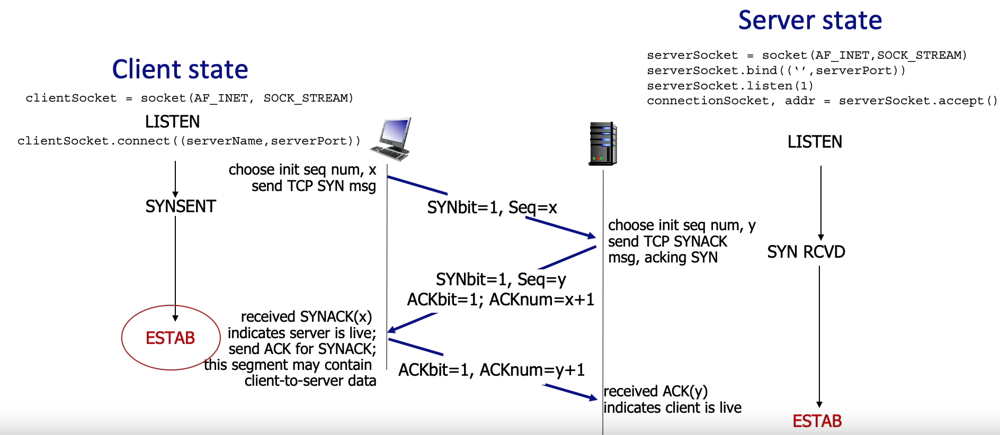
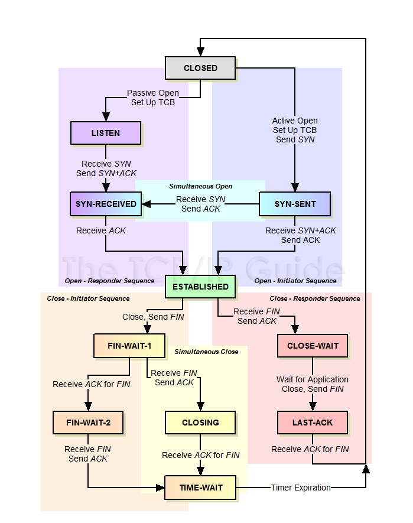

---
aliases:
  - tcp
tags:
  - communication
  - "#tcp"
  - transportlayer
  - demultiplexing
  - multiplexing
  - rdt
  - it
  - http
  - smtp
  - ftp
  - in-writing
---
2025-05-24 18:34
# Transmission control protocol

### Overview of tcp
TCP is one of the most used protocols and is the backbone of [[Hypertext transfer protocol|http]], [[Simple mail transfer protocol|smtp]] and many more [[application layer]] protocols. The reason for this is that it provides a reliable interface to send form one-to-one over the unreliable network. The protocol does not provide message sending like [[User datagram protocol|udp]], but a full in-order byte tunnel for sending. It also provides full duplexing of data and allows sending in both directions. This protocol really is the best thing ever invented. 
The protocol uses cumulative ACKs like [[Reliable data transfer#Go-Back-N|go-back-N]], and also pipe-lining and flow control to not overwhelm the receiver. TCP is connection oriented so it will require a handshake before any data can be sent.
### TCP segment structure

| 16 bit                             |          | 8 bit    | 16 bit               |
| ---------------------------------- | -------- | -------- | -------------------- |
| source port #                      |          |          | destination port #   |
| sequence number #               |          |          |                      |
| acknowledgement number #        |          |          |                      |
| header len                         | not used | CEUAPRSF | receive window    |
| checksum                           |          |          | urg data pointer  |
| options                         |          |          |                      |
| application data (variable length) |          |          |                      |
### TCP timeout values
The easiest way to estimate the value for the timeout is to base it upon the [[round trip time]]. To do this we just start a timer when the segment is sent and measure how long it takes before the ACK is received. But this value may vary by a lot, one segment might be faster than normal, and now you have a timeout that times out prematurely. If that one segment is too slow we might be losing a lot of time with the protocol. Therefore an estimated average is used, described by this formula:

$$
EstimatedRTT = (1-\alpha) * EstimatedRTT + \alpha*SampleRTT
$$

Alpha is often 1.25 here. And this makes it so that the change in the average decreases exponentially based on the previous values. This way we get a stable average for the timeout values at the sender. To calculate the final timeout value we still need a safety margin and the formula for the timeout is as follows:

$$
TimeoutInterval = EstimatedRTT + 4*DeviationRTT
$$
where:
$$
DeviationRTT = (1-\beta)*DeviatoinRTT + \beta * \lvert SampleRTT-EstimaedRTT\rvert
$$
#### MultiACK
If the receiver receives a segment it can wait up to 500 ms to wait and see if any other segments is received. The reason for this is that TCP uses accumulative ACK and that means that one ACK greater than the one that is expected for the client will ACK all the previous unACKed segments. 
#### TCP fast re-transmit
If the sender receives three ACKs for the same sequence number, then it will start sending from there. This is because in the receiver specification they will ACK the last sequence that was good until the next is received. This way the sender dont need to wait for the timeout all the time, and can start sending faster. 
### Flow control
The motivation for flow control is that we do not want to overwhelm the receiving process at the [[application layer]]. If the [[sockets]] buffer is overflowed at the receivers end it will start to drop data, and this can be detrimental to the process. Therefore it is important that the sender controls how much is sent at any given time. This is called flow control. 

The way the receiver communicates the amount of data it can receive is with the receive window field in the header. This will update the sender so that it never sends any more than the window can handle. This can be transmitted on ACKs from the receiver. 

### TCP connection management 
Because the transmission control protocol is a connection oriented protocol it needs to have some shared state between the sender and the receiver, or the initiator and the listener. Both need to know that the connection is established and to listen for segments. This is done by a handshake in the protocol. TCP uses a 3-way handshake to establish a connection. This handshake goes as follows:

First the initiator will send a TCP SYN message and goes into SYN SENT state, and after that the server will reply with SYNACK and go into SYN RECEIVED state. Then the initiator will og to ESTAB state meaning ESTABLISHED, and send the ACK to the server. When the server receives this it is also in the ESTAB state.

To close the tcp connection the the FIN bit is used. When this bit is sent, the other part will send ACK for that and wait for the application process to close. After this it sends the FIN bit and waits for the last ACK. On the other side it will either receive the FIN or the ACK first. If the ACK is first then it will wait for the FIN and after that ACK it and close. If the FIN is first then it will ACK the FIN and wait for the last ACK. After this both parts is closed.
## The final [[finite state machine]] for TCP:

### Congestion control
For reading more about congestion control in tcp, check out [[Congestion control#Congestion control in Transmission control protocol tcp|this]].

## References